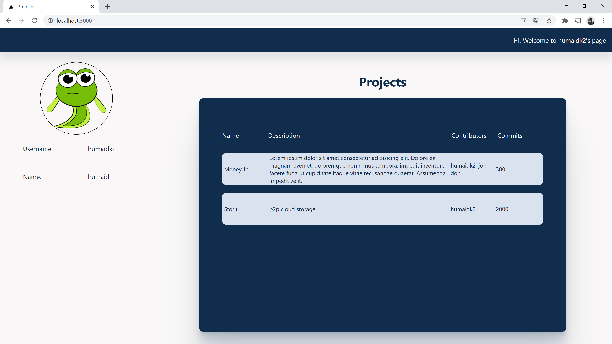

# Project api

Description:

A REST API service for serving project information for users

A Front-end that utilizes the REST service

# Development:

To run this project for development,

docker-compose -f docker-compose.dev.yml build

docker-compose -f docker-compose.dev.yml up

Note: If you're installing a new npm package,
you will need to rebuild your app by doing

docker-compose -f docker-compose.dev.yml build

## **Running URL**

The back-end api will run on:

Test User:

http://localhost:8080/projects/humaidk2

Test Project:

http://localhost:8080/projects/humaidk2/5

Front-end:

http://localhost:3000

# Test:

## Back-end:

Run from root directory:

npm test

## Front-end:

cd project-front

npm run test

# Production:

## Simple setup

Just deploy the dev setup:

-   Install git
-   Install docker
-   Clone project
-   Docker-compose up

## Better setup

Separate front-end and back-end service
Deploy back-end:

-   Create a new docker compose with nginx and https
-   Configure https using certbot and nginx
-   Configure node to use https keys
-   Configure node to setup CORS headers for front-end url
-   Install git
-   Install docker
-   Clone project
-   Docker-compose up

Deploy front-end:

-   Install vercel
-   vercel push

# Tech Stack

-   Next
-   React
-   Node
-   Express
-   Docker
-   Typescript
-   Jest
-   Enzyme
-   Eslint
-   Prettier
-   Mocha
-   Chai

# Todo

### Back-end

-   [x] Initialize app on github
-   [x] Setup basic project service returning dummy data
-   [x] Setup Docker for development using dockerfile and compose
-   [x] Setup typescript for type inference
-   [x] Setup eslint to easily detect inspection errors
-   [x] Setup prettier to have a standard code format and fix eslint errors easily
-   [x] Move routes to separate files for maintainability
-   [x] Test each route using unit testing using mocha, chai

### Optional

-   [] Setup docker for production
-   [] Move start script to node, add sigterm for process management?
-   [] Deploy code to heroku?
-   [] Setup husky for precommit, prepush testing?
-   [] Setup github actions for continuous integration/continuous deployment?
-   [] Setup Database schema/Database?
-   [x] Setup projects to fetch data from github api/sdk?
-   [] Deploy front-end with vercel?

### Front-end

-   [x] Setup front-end using next js
-   [x] Design page to display user and project data
-   [x] Make use of the project-api in the front-end
-   [x] Test front-end using jest

### Author

> [Humaid Khan](https://humaidkhan.com)
